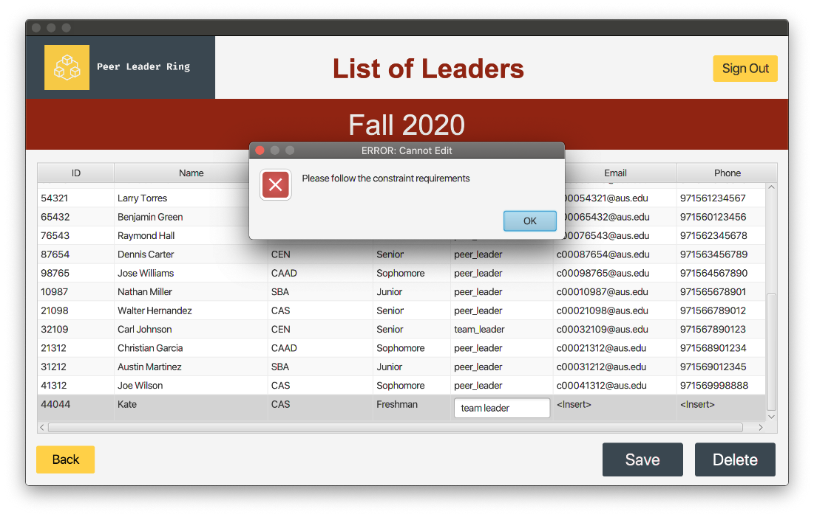

# Peer Leader Ring 

 

This repository contains are Database systems course project for the Fall 2020 semester.   

Peer Leader Ring is an application that is based on the Peer Leader Program run by the Office of Student Affairs (OSA) at the American University of Sharjah (AUS) for new students.  Peer Leader Ring targets the employees of OSA (administrators), the student leaders (peer leader and team leader), and the students (students belonging to different peer groups) as its end users.    

Students refer to new incoming students. Students are put into groups with each group having a peer leader and team leader. Peer leaders are assigned to a single group and have the responsibility to help the students in the group out. Team leaders are more experienced leaders who are part of many groups and support both the peer leaders as well as the students in the groups assigned to them.  Hence each student has a peer leader and team leader assigned to them and can view the details through the application. Along with that, they can view the list of activities offered by the OSA.  The activities refer to the events held during the orientation week to help new students acquaint themselves with the AUS environment. Peer leaders and team leaders mark the attendance of these activities.  Administrators refer to employees of OSA, and they are responsible for creating student groups and adding students along with their corresponding student leaders. In addition to this, they are also responsible for maintaining the activities provided.  They are also provided with a dashboard to view some statistics. 

## Built With

1. JavaFX
2. Hibernate
3. Maven
4. PL/SQL

## Getting Started

This project is built uses Java and Maven 4.0 for dependancy management. You need to both installed to build the project.

Clone the repository

```
git clone https://github.com/JeremyDsilva/Peer-Leader-Ring.git
cd Peer-Leader-Ring
```

Navigate to hibernate.cfg.xml located under src/main/resources and configue your connection string by filling in the Host, Port and Service and your user details.

```xml
<property name="hibernate.connection.url">jdbc:oracle:thin:@Host:Port:Service</property>
<property name="hibernate.connection.username">Username</property>
<property name="hibernate.connection.password">Password</property>
```
The schema.sql and data.sql have database schema and sample data. Run the SQL files on SQL Developer or similar.

Build and run using:

```
mvn clean javafx:run@run
```

You should see the Login screen, Login using one of Ids in the data.sql file with the passwords being set as the as the user id. For example to log in as admin, use the user id of 74902 and password of 74902. When inserting new users system sets password same as the user id.

## Views

### Login

### Team Leader Home Page
 
### Peer Leader Home Page

### Student Home Page

### Change Password

### Activities Page

### Admin Pages
Admin Pages support insertions, updates and deletions


 
 

 




## License
MIT

## Authors
Project was build was part of our University Database course at AUS by

- [Jeremy Dsilva](https://github.com/JeremyDsilva)  
- [Iffa Afsa CM](https://github.com/IffaAfsaCM)  
- [Yash R Gaikwad](https://github.com/YashRGaikwad) 

